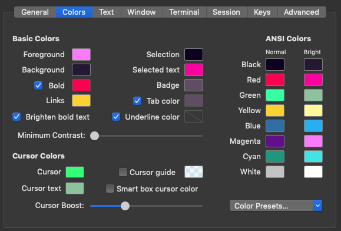

# iTerm2 'r3tro wave'y Design - cyber3i9h7 Theme

An iTerm2 color scheme based on a retro/cyber wave colour pallette  
 
  

## Install

1. Download the file `3i9h7.itermcolors`
2. Open the iTerm2 Preferences menu with hotkey *command+,* or iTerm > Preferences in the menubar
3. Choose *Profiles Page   
  

&nbsp;&nbsp;&nbsp;&nbsp;&nbsp;&nbsp;&nbsp;&nbsp;&nbsp;*Colors Tab*  
&nbsp;&nbsp;&nbsp;&nbsp;&nbsp;&nbsp;&nbsp;&nbsp;&nbsp;  

4. Drop down *Load Presets...*
5. Choose *Import...*
6. Select the `cyber3i9h7.itermcolors` file you downloaded
7. Drop down *Load Presets...* again and select *cyber3i9h7*  
  

## Fonts

8. From the same *Profiles Page > Text Tab*  
  

9. *Cursor* section
- [x] Box
10. *Text Rendering* section
- [x] Draw bold text in bold font
- [ ] Use built-in Powerline glyphs
11. Drop down *Font* and choose 
[JetBrains Mono NL Regular Nerd Font](https://github.com/ryanoasis/nerd-fonts/tree/master/patched-fonts/JetBrainsMono/NoLigatures/Regular/complete)
- [ ] Use ligatures
- [x] Use a different font for non-ASCII text
12. Drop down *Non-ASCII Font* and choose 
[JetBrains Mono Medium Nerd Font](https://github.com/ryanoasis/nerd-fonts/tree/master/patched-fonts/JetBrainsMono/Ligatures/Medium/complete)
- [x] Use Ligatures

13. ⚡️RADICAL⚡️ DUDE! 😎

## ANSI Colours

Color             | Default          |  Lighter   |
---               | ---              |  ---       |
Black             | `#171417`        |  `#414141` |
Red               | `#ff7092`        |  `#ff99ae` |
Green             | `#39e7ab`        |  `#89fca3` |
Yellow            | `#d8e711`        |  `#fed797` |
Blue              | `#ca52e7`        |  `#f315b1` |
Magenta           | `#f45cc5`        |  `#fa95c6` |
Cyan              | `#8e8b3d`        |  `#ddd860` |
White             | `#e1b1e7`        |  `#ffffff` |
